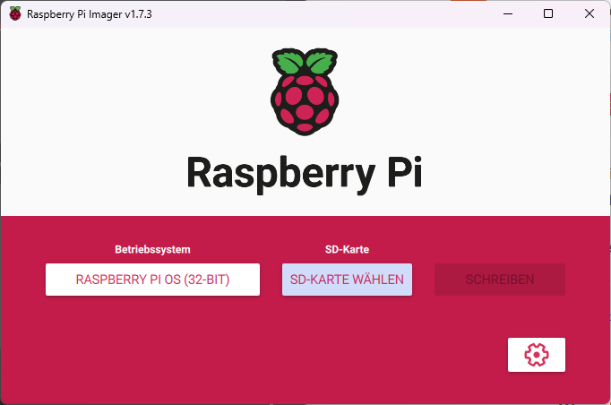
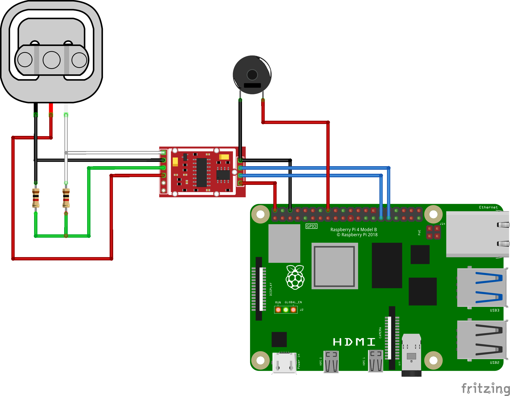

= CheckWeight

== Einleitung

Checkweight ist ein IoT Projekt welches das Gewicht meldet und mittels MQTT warnt, ob eine vom User definierte Gewichtsgrenze überschritten wird

== Vorbereitung

Was du benötigst:

* Raspberry Pi (empfohlen 4) mit Netzteil und einer Speicherkarte (mind. 8 GB empfohlen)

== Checkweight Software installieren

In dieser Anleitung wird der Raspberry via SSH gesteuert, darum sollte diese Option aktiviert sein.

Als allererstes muss der Code vom Python-Skript von Github geklont werden. Hierzu folgendes Befehl verwenden
....
sudo git clone https://github.com/clatsch/checkweight
....

Installation PAHO
....
sudo pip3 install paho-mqtt
....

Installation Mosquitto
....
sudo apt install -y mosquitto mosquitto-clients
....

Mosquitto Autostart
....
sudo systemctl enable mosquitto.service
....

Installation Node Red

....
bash <(curl -sL https://raw.githubusercontent.com/node-red/linux-installers/master/deb/update-nodejs-and-nodered)
....

Something new

